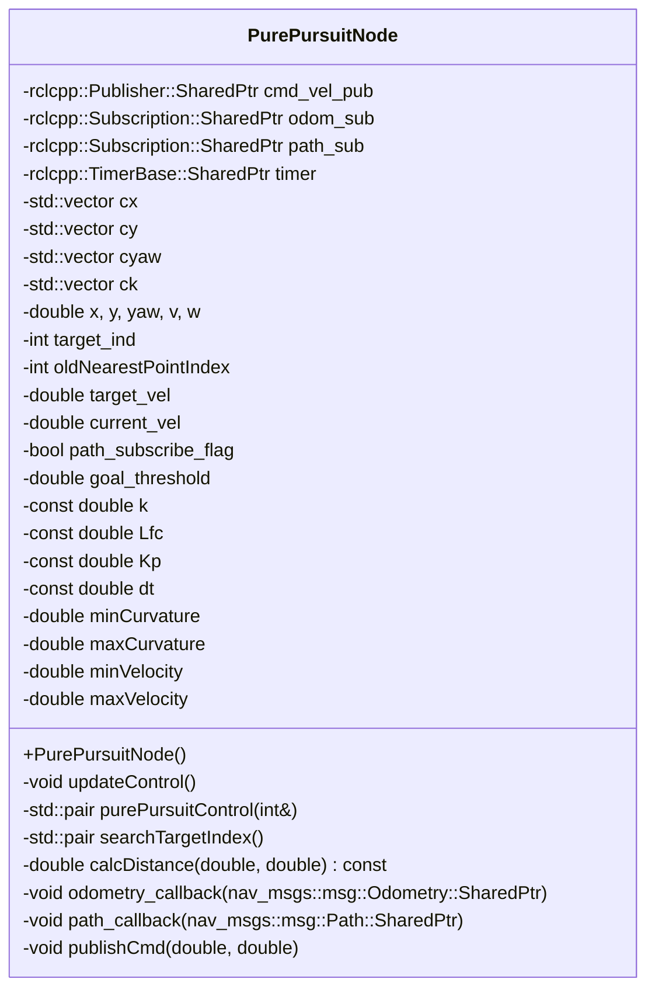
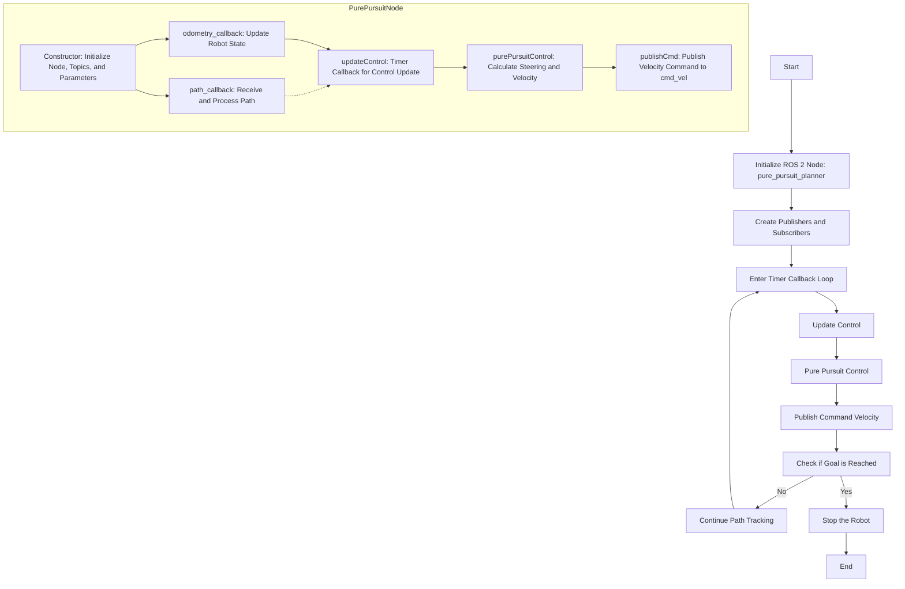
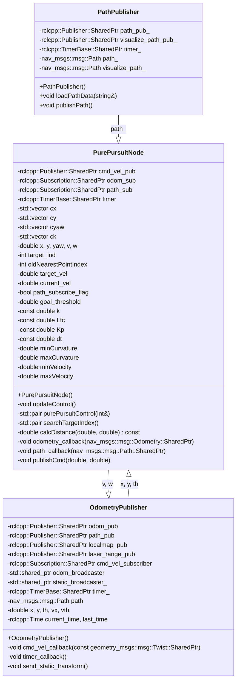

<p style="display: inline">
  <!-- Programming Language -->
  
  <!-- ROS 2 -->
  
</p>

## Functional Overview
This software implements a ROS 2 node for collision avoidance control of robots or autonomous vehicles using the Dynamic Window Approach. It calculates and outputs velocity and angular velocity commands to efficiently navigate the robot.


## Requirements
### System Requirements
- OS : Ubuntu 22.04  
- ROS2 : Humble

### System Dependencies
- [arcanain_simulator](https://github.com/Arcanain/arcanain_simulator) 

## How To Use
### Execution Steps
```bash
cd ~/ros2_ws
source ~/ros2_ws/install/setup.bash
ros2 launch dwa_planner dwa_planner.py
```

### Folder Structure
```
dwa_planner/
├── include/                               - Directory for header files
│   └── pure_pursuit_planner/              - Header files for the pure_pursuit_planner package
│       └── pure_pursuit_planner_component.hpp - Header file for the Pure Pursuit planner component
├── launch/                                - Directory for ROS 2 launch files
│   └── dwa_planner.py            - Launch script for the pure_pursuit_planner node
├── rviz/                                  - Directory for RViz configuration files
│   └── dwa_planner.rviz          - RViz configuration file for the Pure Pursuit planner
├── src/                                   - Directory for source files
│   ├── dwa_noe.cpp - Implementation of the Pure Pursuit planner component
│   └── dwa_planner_node.cpp      - Node implementation for the Pure Pursuit planner
├── CMakeLists.txt                         - CMake build configuration file
└── package.xml                            - ROS 2 package metadata file
```

## Interface Table

### Input

| Variable Name      | Type            | Description                         |
|-------------------------|-------------------|---------------------------------------|
| `odom`                  | `nav_msgs::msg::Odometry` | Odometry information of the robot |
| `tgt_path`              | `nav_msgs::msg::Path` | Target trajectory of the robot |

### Output

| Variable Name      | Type            | Description                         |
|-------------------------|-------------------|---------------------------------------|
| `cmd_vel`               | `geometry_msgs::msg::Twist` | Velocity and angular velocity commands for the robot |

### Internal Values

| Variable Name      | Type            | Description                         |
|-------------------------|-------------------|---------------------------------------|
| `x`, `y`, `yaw`         | `double`          | Current position and orientation of the robot |
| `v`, `w`                | `double`          | Velocity and angular velocity of the robot |
| `cx`, `cy`,`cyaw`, `ck` | `std::vector<double>` | List of x and y coordinates of the path |
| `target_ind`            | `int`             | Current target index |
| `target_vel`            | `double`          | Target velocity |
| `goal_threshold`        | `double`          | Threshold for goal judgment |
| `k`, `Lfc`, `Kp`, `dt`  | `double`          | Pure Pursuit parameters |
| `oldNearestPointIndex`  | `int`             | Index of the nearest point in the previous iteration |
| `current_vel`           | `double`          | Current velocity of the robot |
| `minCurvature`,`maxCurvature`         | `double`          | Minimum and maximum curvature values |
| `minVelocity`,`maxVelocity`           | `double`          | Minimum and maximum velocity values |

## Software architecture

### Class Diagram



### Flowchart



## System architecture


