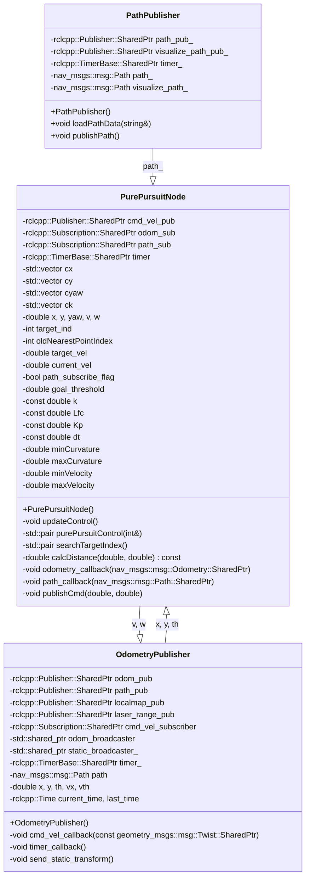

<p style="display: inline">
  <!-- Programming Language -->
  
  <!-- ROS 2 -->
  
</p>

## Functional Overview
This software implements a ROS 2 node for collision avoidance control of robots or autonomous vehicles using the Dynamic Window Approach. It calculates and outputs velocity and angular velocity commands to efficiently navigate the robot.


## Requirements
### System Requirements
- OS : Ubuntu 22.04  
- ROS2 : Humble

### System Dependencies
- [arcanain_simulator](https://github.com/Arcanain/arcanain_simulator) 

## How To Use
### Execution Steps
```bash
cd ~/ros2_ws
source ~/ros2_ws/install/setup.bash
ros2 launch dwa_planner dwa_planner.py
```

### Directory
```
dwa_planner/
├── CMakeLists.txt                         - CMake build configuration file for the DWA planner
├── package.xml                            - ROS 2 package metadata file
├── config/                                - Directory for YAML parameter/config files
│   └── dwa_params.yaml                    - YAML file specifying DWA parameters (max_vel, etc.)
├── launch/                                - Directory for ROS 2 launch files
│   └── dwa_planner.launch.py              - Launch script for the DWA planner node and parameter loading
├── include/                               - Directory for header files
│   └── dwa_planner/                       - Header files for the dwa_planner package
│       ├── dwa_planner_component.hpp      - Header file for the DWA planner core component (algorithm)
│       └── dwa_planner_node.hpp           - Header file for the DWA planner ROS Node
└── src/                                   - Directory for source files
    ├── dwa_planner_component.cpp          - Implementation of the DWA planner core (algorithm)
    ├── dwa_planner_node.cpp               - Node implementation for the DWA planner, handling ROS interfaces
    └── dwa_planner.cpp                    - Main entry point (executable) that spins the dwa_planner node
```

## Interface Table

### Input

| Variable Name      | Type            | Description                         |
|-------------------------|-------------------|---------------------------------------|
| `odom`                  | `nav_msgs::msg::Odometry` | Odometry information of the robot |
| `tgt_path`              | `nav_msgs::msg::Path` | Target trajectory of the robot |

### Output

| Variable Name      | Type            | Description                         |
|-------------------------|-------------------|---------------------------------------|
| `cmd_vel`               | `geometry_msgs::msg::Twist` | Velocity and angular velocity commands for the robot |

### Internal Values

| Variable Name      | Type            | Description                         |
|-------------------------|-------------------|---------------------------------------|
| `x`, `y`, `yaw`         | `double`          | Current position and orientation of the robot |
| `v`, `w`                | `double`          | Velocity and angular velocity of the robot |
| `cx`, `cy`,`cyaw`, `ck` | `std::vector<double>` | List of x and y coordinates of the path |
| `target_ind`            | `int`             | Current target index |
| `target_vel`            | `double`          | Target velocity |
| `goal_threshold`        | `double`          | Threshold for goal judgment |
| `k`, `Lfc`, `Kp`, `dt`  | `double`          | Pure Pursuit parameters |
| `oldNearestPointIndex`  | `int`             | Index of the nearest point in the previous iteration |
| `current_vel`           | `double`          | Current velocity of the robot |
| `minCurvature`,`maxCurvature`         | `double`          | Minimum and maximum curvature values |
| `minVelocity`,`maxVelocity`           | `double`          | Minimum and maximum velocity values |

## Software architecture

### Class Diagram

```mermaid
classDiagram
    class DWA {
        +DynamicWindowApproach(x, model, goal, evalParam, ob, R, robotR) : vector<double>
        -CalcDynamicWindow(x, model) : array<double, 4>
        -GenerateTrajectory(x, vt, ot, evaldt) : array<double, 5>
        -CalcHeadingEval(x, goal) : double
        -CalcDistEval(x, ob, R, robotR) : double
        -NormalizeEval(evalDB) : void
        -SelectBestControl(evalDB, evalParam) : vector<double>
    }

    class DWAPlannerNode {
        +DWAPlannerNode()
        +~DWAPlannerNode()
        -timerCallback() : void
        -odomCallback(msg) : void
        -local_obstacle_callback(msg) : void
        -target_callback(msg) : void
        -send_static_transform() : void
        -x_ : array<double, 5>
        -goal_ : array<double, 2>
        -obstacle_ : vector<array<double, 2>>
        -kinematic_ : array<double, 6>
        -eval_param_ : array<double, 4>
        -robot_radius_ : double
        -obstacle_radius_ : double
        -received_obstacles_ : bool
        -received_goal_ : bool
        -received_odom_ : bool
    }

    DWAPlannerNode "1" --> "1" DWA : Uses
    DWAPlannerNode o-- rclcpp::Node : Extends
    rclcpp::Node <|-- DWAPlannerNode

    DWA : <<static_methods_only>>

    %% Other related components
    class rclcpp::Node {
        <<library>>
    }
```

### Flowchart

```mermaid
flowchart TD
    Start["Start: DWAPlannerNode Initialized"] --> CheckOdom
    CheckOdom{"Received Odometry?"}
    CheckOdom -->|No| WaitOdom[Display "Waiting for /odom..."]
    WaitOdom --> CheckOdom
    CheckOdom -->|Yes| CheckObstacles{"Received Obstacles?"}
    
    CheckObstacles -->|No| WaitObstacles[Display "Waiting for local_obstacle_markers..."]
    WaitObstacles --> CheckObstacles
    CheckObstacles -->|Yes| CheckGoal{"Received Goal?"}
    
    CheckGoal -->|No| WaitGoal[Display "Waiting for /waypoint..."]
    WaitGoal --> CheckGoal
    CheckGoal -->|Yes| ComputeDWA
    
    ComputeDWA["Call DWA::DynamicWindowApproach"] --> EvaluateDynamicWindow
    EvaluateDynamicWindow["CalcDynamicWindow"] --> EvaluateTrajectories
    EvaluateTrajectories["GenerateTrajectory for Each (vt, ot)"] --> EvaluateMetrics
    EvaluateMetrics["CalcHeadingEval, CalcDistEval, CalcVel"] --> FilterValidPaths
    FilterValidPaths{"Valid Paths Available?"}
    FilterValidPaths -->|No| NoPath[Display "No path to goal! Return [0.0, 0.0]"]
    FilterValidPaths -->|Yes| NormalizeEvals
    
    NormalizeEvals["NormalizeEval"] --> SelectBest
    SelectBest["SelectBestControl"] --> PublishCommand
    PublishCommand["Publish /cmd_vel Command"] --> End["End"]

```

## System architecture


