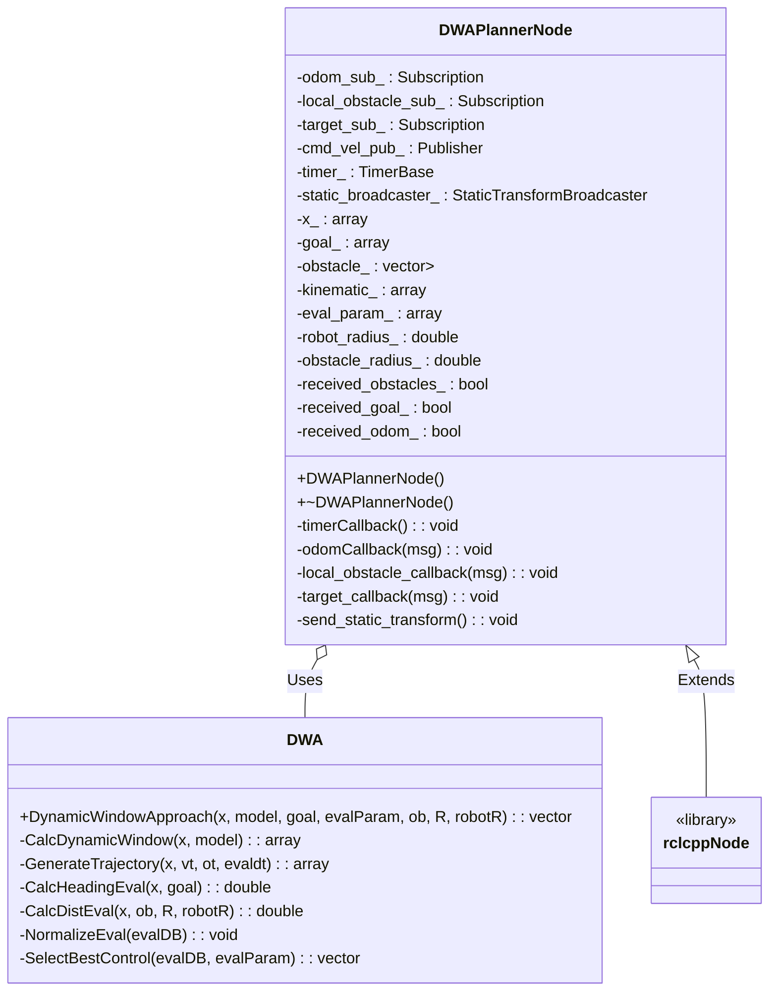
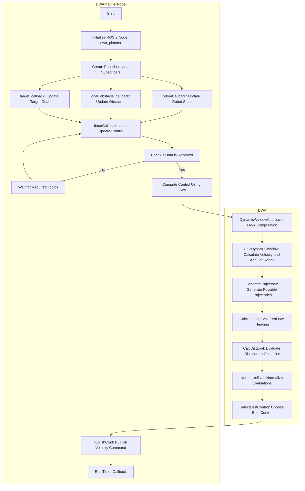

<p style="display: inline">
  <!-- Programming Language -->
  
  <!-- ROS 2 -->
  
</p>

## Functional Overview
This software implements a ROS 2 node for collision avoidance control of robots or autonomous vehicles using the Dynamic Window Approach. It calculates and outputs velocity and angular velocity commands to efficiently navigate the robot.


## Requirements
### System Requirements
- OS : Ubuntu 22.04  
- ROS2 : Humble

### System Dependencies
- [arcanain_simulator](https://github.com/Arcanain/arcanain_simulator) 

## How To Use
### Execution Steps
```bash
cd ~/ros2_ws
source ~/ros2_ws/install/setup.bash
ros2 launch dwa_planner dwa_planner.py
```

### Folder Structure
```
dwa_planner/
├── include/                               - Directory for header files
│   └── pure_pursuit_planner/              - Header files for the pure_pursuit_planner package
│       └── pure_pursuit_planner_component.hpp - Header file for the Pure Pursuit planner component
├── launch/                                - Directory for ROS 2 launch files
│   └── dwa_planner.py            - Launch script for the pure_pursuit_planner node
├── rviz/                                  - Directory for RViz configuration files
│   └── dwa_planner.rviz          - RViz configuration file for the Pure Pursuit planner
├── src/                                   - Directory for source files
│   ├── dwa_noe.cpp - Implementation of the Pure Pursuit planner component
│   └── dwa_planner_node.cpp      - Node implementation for the Pure Pursuit planner
├── test/
│   ├── test_dwa_component.cpp             - Unit test
│   ├── test_dwa_node.cpp                  - Integration test
│   └── test_utils.hpp                     - Utility
├── CMakeLists.txt                         - CMake build configuration file
└── package.xml                            - ROS 2 package metadata file
```

## How To Build & Test

### Step0: Prepare
```bash
sudo apt install lcov
```

### Step1: build
```bash
cd ~/ros2_ws
colcon build --packages-select dwa_planner --cmake-args -DCMAKE_CXX_FLAGS="--coverage"
```

### Step2: test
```bash
cd ~/ros2_ws
colcon test --packages-select dwa_planner
colcon test-result --verbose
```

### Step3: create coverage report
```bash
cd ~/ros2_ws/build/dwa_planner
lcov --directory . --capture --output-file coverage.info
lcov --remove coverage.info '/usr/*' '/opt/ros/*' '*/test/*' --output-file coverage.filtered.info
genhtml coverage.filtered.info --output-directory coverage_html --branch-coverage
xdg-open coverage_html/index.html
```

## csv test
```
colcon test \
  --packages-select dwa_planner \
  --event-handlers console_direct+ \
  --ctest-args -R test_dwa_csv

colcon test-result --verbose
```

```
# ワークスペース直下で
find build/dwa_planner -type f -name test_results.csv
```

## Interface Table

### Input

| Variable Name           | Type                                    | Description                                   |
|--------------------------|-----------------------------------------|-----------------------------------------------|
| `odom`                  | `nav_msgs::msg::Odometry`              | Odometry information of the robot             |
| `local_obstacle_markers`| `visualization_msgs::msg::MarkerArray` | Local obstacles around the robot              |
| `waypoint`              | `geometry_msgs::msg::PoseStamped`      | Target goal position for the robot            |

### Output

| Variable Name           | Type                         | Description                                   |
|--------------------------|------------------------------|-----------------------------------------------|
| `cmd_vel`               | `geometry_msgs::msg::Twist` | Velocity and angular velocity commands for the robot |

### Internal Values

| Variable Name           | Type                                    | Description                                   |
|--------------------------|-----------------------------------------|-----------------------------------------------|
| `x_`                    | `std::array<double, 5>`                | Current state of the robot: [x, y, yaw, v, w] |
| `goal_`                 | `std::array<double, 2>`                | Target goal position: [goal_x, goal_y]        |
| `obstacle_`             | `std::vector<std::array<double, 2>>`   | List of local obstacle positions: [x, y]      |
| `kinematic_`            | `std::array<double, 6>`                | Robot kinematic parameters                    |
| `eval_param_`           | `std::array<double, 4>`                | Parameters for evaluation functions           |
| `robot_radius_`         | `double`                               | Radius of the robot                           |
| `obstacle_radius_`      | `double`                               | Radius of obstacles                           |
| `received_odom_`        | `bool`                                 | Flag indicating whether odometry data is received |
| `received_obstacles_`   | `bool`                                 | Flag indicating whether obstacle data is received |
| `received_goal_`        | `bool`                                 | Flag indicating whether goal data is received |
| `timer_`                | `rclcpp::TimerBase::SharedPtr`         | Timer for periodic callbacks                  |
| `static_broadcaster_`   | `std::shared_ptr<tf2_ros::StaticTransformBroadcaster>` | Broadcaster for static transforms |
| `DT`                    | `const double`                         | Time step for computations                    |
| `DWA`                   | `class`                                | DWA computation instance                      |

## System architecture


## Software architecture

### Class Diagram



### Flowchart


